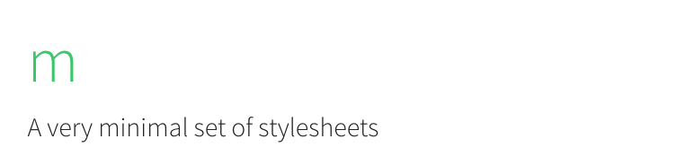

## m
(n.) minimalistic stylesheets

[Demo](https://m.kierb.com) / [Preview](preview.png)

## Why?
- This is not another UI Framework.
- I'd like to get my feet wet with SUITCSS's Conventions.
- See if I can achieve a much more cleaner CSS so far.

## Also
- No documentation.
- Not maintained.
- A *lesser* [Skeleton CSS](http://getskeleton.com/).
  - Use it for ideas.
  - Use it as a starting point.
- Has useful mixins and utilities!

## 101
- Includes [normalize.scss](https://necolas.github.io/normalize.css/)
- Loosely follows [SUITCSS Conventions](https://github.com/suitcss/suit/blob/master/doc/naming-conventions.md).
- Loosely follows [codeguide](http://codeguide.co/).
- Uses [Font Awesome](https://fortawesome.github.io/Font-Awesome/).
- Avoid `margin-top` when possible.
- Mixins
  - Since mixins are kept simple, use them whenever you can.
- Variables
  - Inspiration taken from [Medium's Coding Guidelines#Variables](https://gist.github.com/fat/a47b882eb5f84293c4ed#variables).
  - Naming
	- `<property>-<value>[--ComponentName]`
  	  - `$color-grayLight`
  	  - `$color-grayLight--Modal`
  	  - `$fontSize-large`
  - Colors
    - Lowercase hex values

## Running
```bash
make dev # compiles and watches for changes.
make # make a clean release
```
